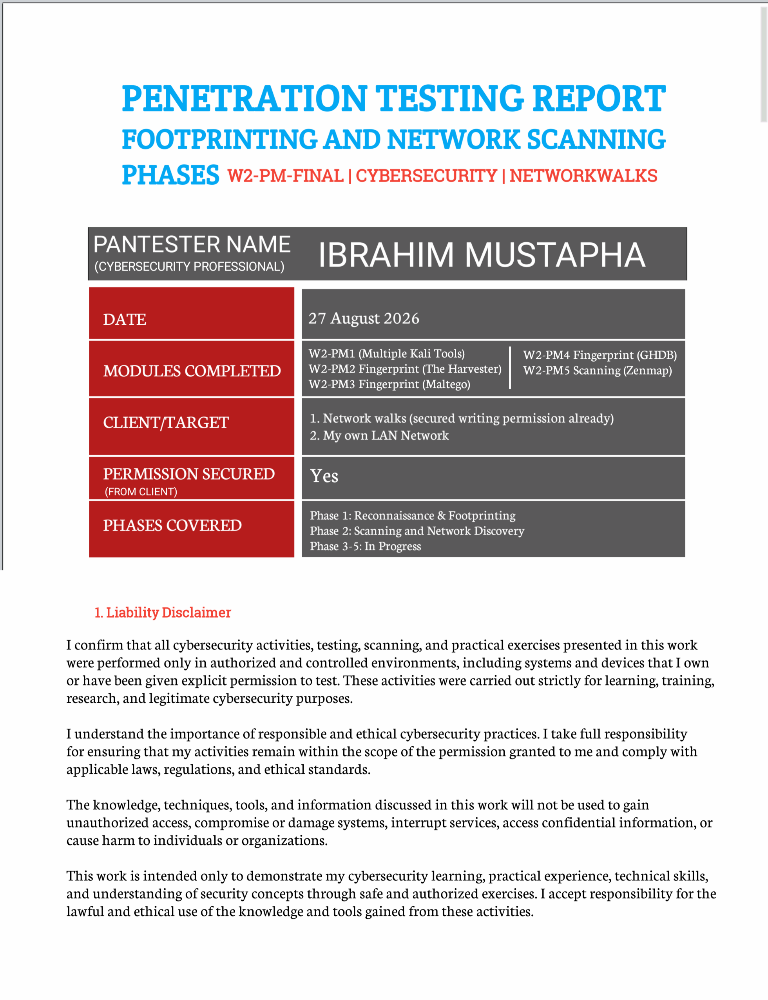
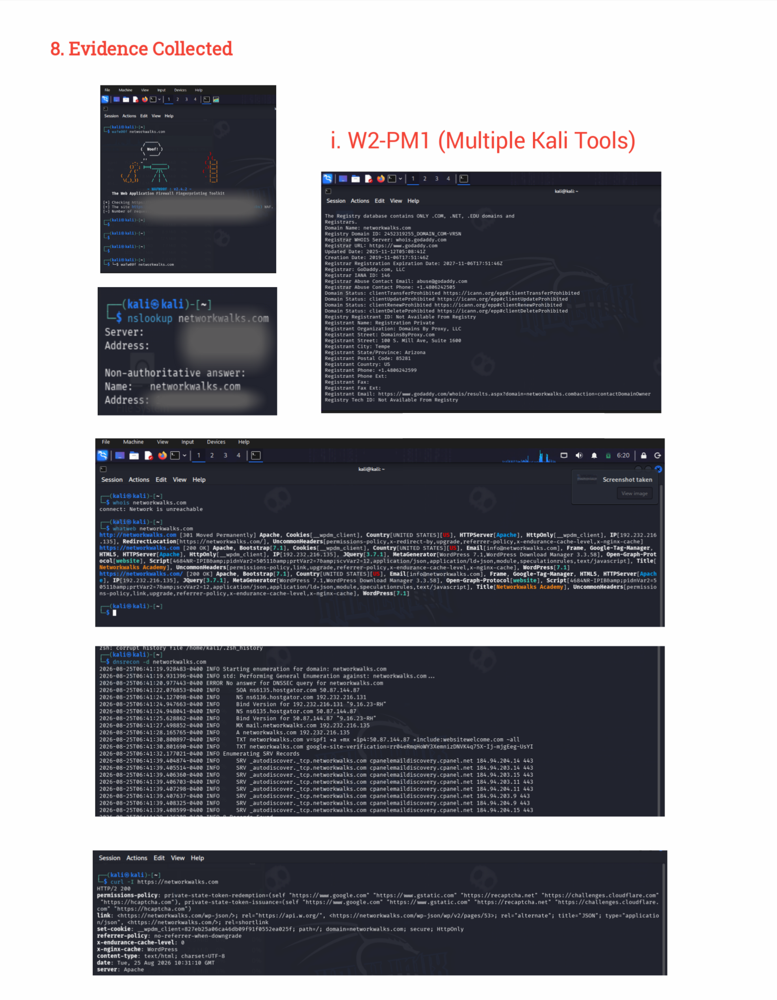
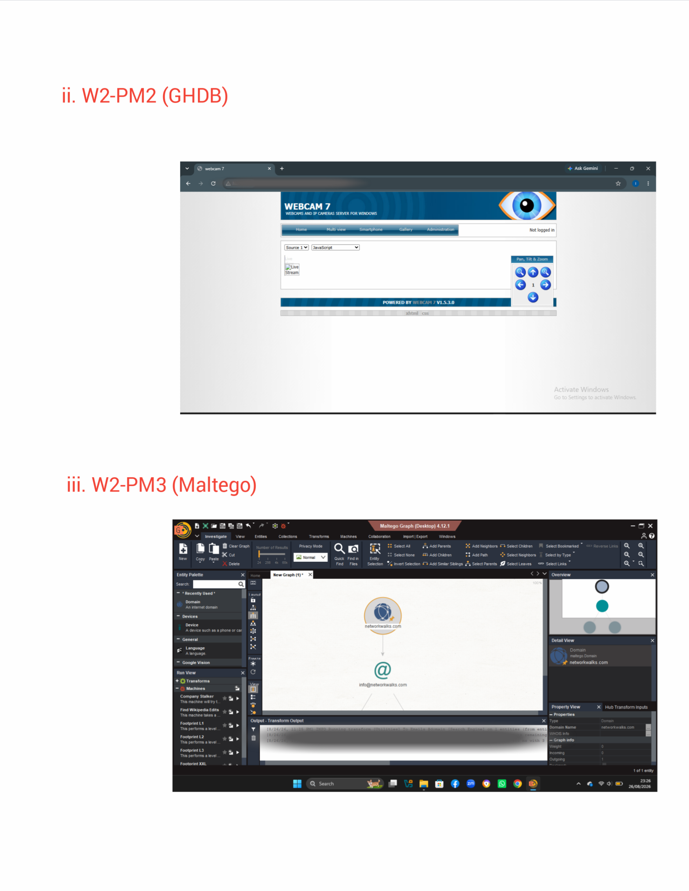
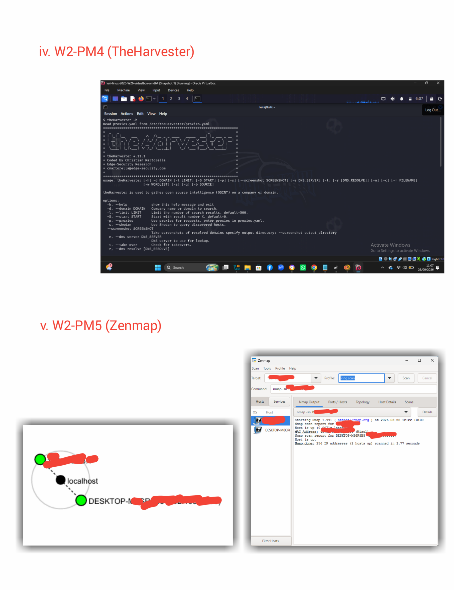

## 1. Introduction

This report presents the practical activities I completed during Week 2 of my cybersecurity internship at NetworkWalks. The week focused on practical network security concepts, reconnaissance, information gathering, and network scanning using different cybersecurity tools and techniques.

The practical activities covered five main tasks: **W2-PM1: Multiple Kali Linux Tools, W2-PM2: Google Hacking Database (GHDB), W2-PM3: Maltego, W2-PM4: TheHarvester-Based Footprinting Attacks, and W2-PM5: Zenmap-Based Network Scanning.**

Throughout these exercises, I practiced different methods of gathering information about a target, identifying publicly available information, performing footprinting and reconnaissance, and scanning an authorized local network to identify active hosts and available network information.

All practical activities were performed in controlled and authorized environments for educational, training, and legitimate cybersecurity assessment purposes. The report documents the tools and techniques used, the procedures followed, observations made, screenshots of the practical work, and the security relevance of the findings.

## 2. Tools Used

The following tools and technologies were used during the Week 2 practical activities:

| Tool / Technology | Purpose                                                                                                                   |
| ----------------- | ------------------------------------------------------------------------------------------------------------------------- |
| Kali Linux        | Operating system used for cybersecurity reconnaissance and security testing                                               |
| WHOIS             | Used to obtain publicly available domain registration information                                                         |
| WhatWeb           | Used to identify web technologies and information about a website                                                         |
| Nslookup          | Used to perform DNS queries and resolve domain names to IP addresses                                                      |
| cURL              | Used to retrieve HTTP response headers from a website                                                                     |
| Wafw00f           | Used to identify whether a website is protected by a Web Application Firewall (WAF)                                       |
| DNSRecon          | Used to perform DNS enumeration and gather DNS-related information                                                        |
| GHDB              | Used to explore advanced search queries for publicly indexed information                                                  |
| Maltego           | Used for visual link analysis and information gathering during reconnaissance                                             |
| TheHarvester      | Used to gather publicly available information such as domains, subdomains, email addresses, and other reconnaissance data |
| Zenmap            | Used as a graphical interface for Nmap to scan the local network and identify active hosts and network information        |
| Windows CMD       | Used to identify local network configuration, IP address, and MAC address information                                     |

## 3. Activities Performed

### 3.1 W2-PM1: Multiple Kali Linux Tools

In this practical, I used multiple Kali Linux tools to perform basic footprinting and reconnaissance against an authorized target. The purpose was to understand how different tools can be used to collect different types of information during a cybersecurity assessment.

The tools used included **WHOIS, WhatWeb, Nslookup, cURL, Wafw00f, and DNSRecon**. Each tool was used for a specific reconnaissance task, such as identifying domain registration details, discovering web technologies, resolving DNS information, examining HTTP response headers, detecting web application firewalls, and enumerating DNS records.

The practical activities provided information about domain infrastructure, web technologies, HTTP headers, potential Web Application Firewall (WAF) protection, DNS records, and publicly discoverable information such as email addresses, hosts, and related domain information. These results showed how multiple reconnaissance techniques can be combined during the information-gathering phase of a security assessment.

### 3.2 W2-PM2: GHDB

For W2-PM2, I explored the **Google Hacking Database (GHDB)** to understand how advanced search operators can be used to identify information that has been publicly indexed by search engines.

The practical focused on understanding different search techniques and how security researchers can use them during reconnaissance to discover publicly available information about websites and systems.

This exercise improved my understanding of the importance of information exposure and how improperly indexed information can potentially increase an organization's attack surface.

### 3.3 W2-PM3: Maltego

For W2-PM3, I used **Maltego** as a reconnaissance and link-analysis tool. The practical introduced me to the process of collecting and visually connecting information related to a target.

Maltego helped demonstrate how different pieces of information, such as domains, DNS-related data, and other publicly available entities, can be connected to provide a broader view of a target's digital footprint.

This practical improved my understanding of how security professionals can organize and analyze reconnaissance information during an assessment.

### 3.4 W2-PM4: TheHarvester-Based Footprinting Attacks

In W2-PM4, I used **TheHarvester** to perform authorized footprinting against the specified target. The objective was to gather publicly available information that could be useful during the reconnaissance stage of a security assessment.

The exercise focused on understanding how tools such as TheHarvester can collect information from publicly available sources, including domains, subdomains, email addresses, and other relevant data where available.

The practical demonstrated the importance of monitoring publicly exposed information because information gathered during footprinting can potentially be useful to an attacker during the early stages of an attack.

### 3.5 W2-PM5: Zenmap-Based Network Scanning

For W2-PM5, I used **Zenmap**, the graphical interface for Nmap, to conduct network discovery on my authorized local network. The objective was to identify the local network range, discover active hosts, obtain available IP and MAC address information, and visualize the discovered network topology.

I first used the Windows **ipconfig** command to determine my local IP address, subnet mask, and network range. I then entered the identified subnet into Zenmap and performed a **Ping Scan** to detect active hosts on the network.

The scan results enabled me to identify live devices connected to my local network together with their available addressing information. I subsequently used Zenmap's **Topology** feature to visualize the discovered network devices, enabled the appropriate legend, and exported the resulting network topology as a PDF for documentation and evidence.

This practical provided hands-on experience with network discovery and demonstrated how security professionals can use authorized scanning tools to understand the devices and network structure within a local environment.

## 4. Risk Analysis / Impact

Based on the information collected during the footprinting, reconnaissance, and network scanning activities, I identified the following potential security risks and observations. These findings represent information-disclosure and reconnaissance-related concerns rather than confirmed vulnerabilities.

| # | Risk / Finding                               | Evidence / Observation                                                                                                                                                    | Potential Impact                                                                                                                                        | Risk Level |
| - | -------------------------------------------- | ------------------------------------------------------------------------------------------------------------------------------------------------------------------------- | ------------------------------------------------------------------------------------------------------------------------------------------------------- | ---------- |
| 1 | Web technology information exposed           | WhatWeb identified WordPress and WP Download Manager on the web application.                                                                                              | An attacker may use the exposed technology information to identify the software in use and determine whether further security review is required.       | **Medium** |
| 2 | Server IP address identifiable               | Nslookup resolved the domain to the IP address **192.232.216.135**.                                                                                                       | This provides information about the network location of the web service and may support further reconnaissance.                                         | **Low**    |
| 3 | HTTP technical information exposed           | cURL returned HTTP response headers and exposed the **/wp-json/** endpoint.                                                                                               | The information may assist with technology fingerprinting and further enumeration of the web application.                                               | **Low**    |
| 4 | WAF technology identifiable                  | Wafw00f identified **ModSecurity (SpiderLabs)** as the Web Application Firewall technology.                                                                               | This reveals information about the security architecture of the web application and may help an attacker understand the protection mechanisms in place. | **Low**    |
| 5 | DNS infrastructure information exposed       | DNSRecon identified DNS, mail, and other service-related records.                                                                                                         | The information can help an attacker build a broader profile of the organization's network and supporting infrastructure.                               | **Medium** |
| 6 | Publicly discoverable information            | GHDB and TheHarvester demonstrated that publicly indexed and openly available information can reveal details such as domains, hosts, and email addresses where available. | Such information may assist an attacker during the reconnaissance and information-gathering stage of an attack.                                         | **Medium** |
| 7 | Multiple live hosts visible on local network | Zenmap identified various live hosts in the authorized local network.                                                                                                     | Unknown or unauthorized devices on the network could potentially increase the attack surface if they are not properly managed or secured.               | **Medium** |

### Risk Level Key

* **Critical** – Represents a potentially severe security risk requiring immediate attention.
* **High** – Represents a significant security concern that should be investigated and addressed promptly.
* **Medium** – Represents a security concern that should be investigated and addressed.
* **Low** – Represents a minor security concern or information disclosure that may assist further reconnaissance.

The identified observations highlight the importance of minimizing unnecessary information exposure, maintaining secure configurations, monitoring publicly available information, and regularly reviewing devices and services within an authorized network environment.

## 5. Recommendations

Based on the observations from the Week 2 footprinting, reconnaissance, GHDB, Maltego, TheHarvester, and network scanning activities, I recommend the following security measures:

1. **Minimize publicly exposed technical information**

Organizations should regularly review their websites and online services and reduce unnecessary disclosure of information about web technologies, CMS platforms, plugins, servers, and other software components.

2. **Keep software and applications updated**

Web applications, CMS platforms, plugins, operating systems, and other software should be regularly updated and monitored for newly discovered security vulnerabilities.

3. **Review HTTP response headers**

HTTP response headers should be reviewed to identify unnecessary technical information that could assist reconnaissance. Where appropriate, unnecessary information should be removed or restricted.

4. **Regularly review DNS records**

DNS records should be periodically reviewed to ensure that only necessary services and information are publicly accessible. Unused or outdated records should be removed.

5. **Properly configure and monitor the Web Application Firewall**

The Web Application Firewall should remain enabled, properly configured, and regularly monitored. Its rules should be reviewed and updated to provide effective protection against common web-based attacks.

6. **Monitor publicly available information**

Organizations should regularly review information that can be discovered through search engines, GHDB, TheHarvester, Maltego, and other reconnaissance techniques. Unnecessary exposure of domains, hosts, email addresses, and other sensitive information should be minimized.

7. **Conduct regular internal network discovery**

Organizations should periodically scan their authorized internal networks to identify active devices and maintain an accurate understanding of the network environment.

8. **Investigate unknown devices**

Any unfamiliar device identified during network discovery should be investigated and verified to determine whether it is authorized. Unauthorized devices should be removed or isolated where necessary.

9. **Maintain up-to-date network documentation**

Network diagrams, IP addresses, device information, and other relevant infrastructure details should be properly documented and updated whenever changes are made.

10. **Perform security testing only with proper authorization**

Footprinting, reconnaissance, scanning, vulnerability assessment, and other security testing activities should only be conducted on systems and networks where appropriate permission has been obtained. This ensures that security assessments are performed legally, ethically, and responsibly.

## 6. Conclusion

During Week 2 of my Cybersecurity and Ethical Hacking internship at NetworkWalks, I completed practical exercises covering footprinting, reconnaissance, information gathering, and network scanning.

In **W2-PM1**, I used multiple Kali Linux tools, including WHOIS, WhatWeb, Nslookup, cURL, Wafw00f, and DNSRecon, to gather and analyze information related to an authorized target. These exercises helped me understand domain information, web technologies, DNS records, HTTP headers, and Web Application Firewall detection.

In **W2-PM2**, I explored the Google Hacking Database (GHDB) and learned how advanced search operators can be used to identify publicly indexed information. In **W2-PM3**, I used Maltego to understand visual link analysis and how different pieces of publicly available information can be connected during reconnaissance.

In **W2-PM4**, I used TheHarvester to perform authorized footprinting and gather publicly available information such as domains, subdomains, email addresses, and related reconnaissance data where available. This helped me understand the importance of monitoring an organization's publicly exposed digital footprint.

In **W2-PM5**, I used Windows **ipconfig** and Zenmap to perform network discovery on my authorized local network. I identified the local network range, performed a Ping Scan to discover active hosts, reviewed available IP and MAC address information, and used Zenmap's Topology feature to visualize the discovered network structure. I also exported the topology as a PDF for documentation and evidence.

Overall, these practical exercises improved my understanding of how cybersecurity professionals gather information, analyze a target's exposed resources, and perform authorized network discovery. I also learned that information gathered during reconnaissance can provide useful insight into an organization's attack surface, even without attempting to exploit any system.

The exercises further strengthened my understanding of professional cybersecurity documentation. A good security report should clearly explain the activities performed, tools used, observations made, potential risks, and recommended security measures.

Finally, I learned the importance of conducting all reconnaissance and scanning activities within an authorized and ethical scope. All activities documented in this report were performed for approved educational, training, and cybersecurity assessment purposes.

## 7. Evidence Collected 

